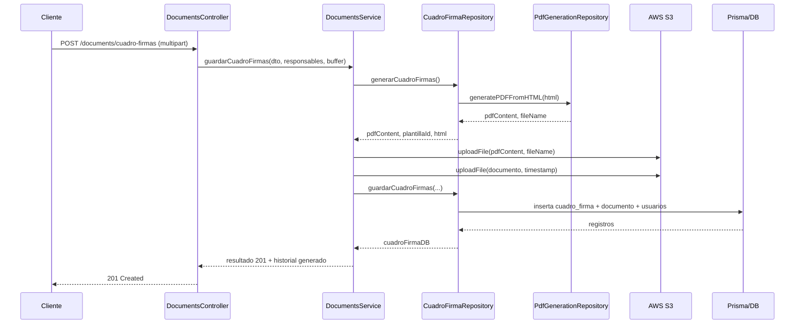
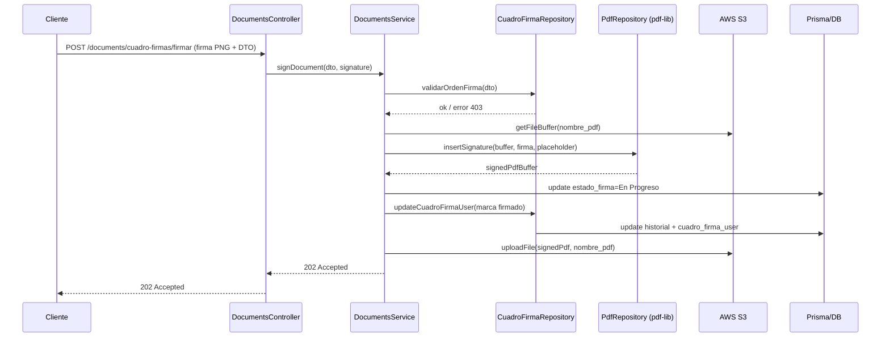
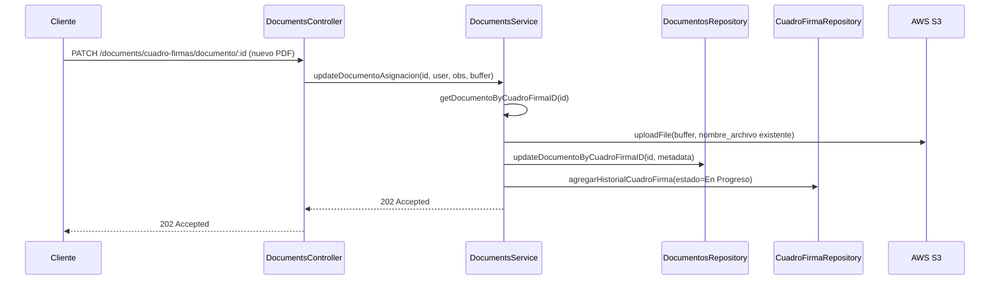

# Módulo de Documentos y Cuadro de Firmas

## 1. Propósito y alcance

Este documento describe a profundidad el módulo de Documentos / Cuadro de Firmas del backend NestJS. Detalla la arquitectura, los flujos de generación y firma de PDF, las responsabilidades de cada endpoint y los contratos de datos. Incluye ejemplos de peticiones reales, errores frecuentes, recomendaciones operativas y una propuesta de pruebas manuales.

## 2. Arquitectura funcional

### 2.1 Componentes principales

| Componente | Rol |
| --- | --- |
| `DocumentsController` | Expone las rutas REST bajo `/documents` y delega toda la lógica de negocio al servicio. Maneja multipart con `FilesInterceptor` y parsea JSON en campos string usando `JsonParsePipe`.【F:src/documents/documents.controller.ts†L32-L232】【F:src/common/json-pipe/json-pipe.pipe.ts†L8-L24】 |
| `DocumentsService` | Orquesta operaciones de PDFs, S3 y Prisma: genera plantillas, crea cuadros de firmas, gestiona historiales, valida firmas y actualiza documentos asociados.【F:src/documents/documents.service.ts†L43-L817】 |
| `PrismaCuadroFirmaRepository` | Implementa consultas Prisma específicas para cuadros de firmas (generación HTML→PDF, asignación de responsables, historiales, validación de orden de firma, listados).【F:src/database/infrastructure/prisma-cuadro-firmas.repository.ts†L32-L674】 |
| `PrismaDocumentosRepository` | Actualiza metadata del documento de negocio asociado a un cuadro.【F:src/database/infrastructure/pirsma-documentos.repository.ts†L7-L34】 |
| `AWSService` | Encapsula la carga y lectura de archivos en S3 (upload, presigned URL, obtención de buffer).【F:src/aws/aws.service.ts†L12-L182】 |
| `PdfGenerationRepository` (`PDFPuppeteerRepository`) | Renderiza HTML personalizado en PDF usando Puppeteer y reemplazo de placeholders.【F:src/pdf/infrastructure/pdf-pupeteer.repository.ts†L6-L50】 |
| `PdfRepository` (`PdfLibRepository`) | Usa pdf-lib y pdfjs para localizar placeholders, centrar firmas/fechas y dibujar contenidos en el PDF existente.【F:src/pdf/infrastructure/pdf-lib.repository.ts†L105-L467】 |

### 2.2 Flujo general

1. **Plantilla**: se registra un HTML por empresa con color y logo, partiendo de `src/templates/cuadroFirmas.html` que define la tabla `Nombre | Puesto | Gerencia | Firma | Fecha` con anchos fijos.【F:src/documents/documents.service.ts†L252-L301】【F:src/templates/cuadroFirmas.html†L95-L230】
2. **Generación de cuadro**: al crear un cuadro, se reemplazan placeholders con los responsables, se renderiza el PDF con Puppeteer y se sube a S3 junto con el documento de negocio. Se crean registros en `cuadro_firma`, `cuadro_firma_user`, `documento` y se añade historial en estado “Generado” (id 4).【F:src/documents/documents.service.ts†L316-L427】【F:src/database/infrastructure/prisma-cuadro-firmas.repository.ts†L45-L155】【F:src/documents/documents.controller.ts†L108-L168】
3. **Firma secuencial**: cada responsable firma en orden (Elabora → Revisa → Aprueba → Enterado) mediante `PdfLibRepository.insertSignature`, que centra la firma y la fecha en sus celdas. Se valida el placeholder `FECHA_<ROL>_<slug>` según el nombre enviado y se actualiza S3, `cuadro_firma_user` y el historial a estado “En Progreso” (id 2).【F:src/documents/documents.service.ts†L118-L233】【F:src/database/infrastructure/prisma-cuadro-firmas.repository.ts†L606-L645】
4. **Consulta y supervisión**: se exponen URLs prefirmadas, historiales paginados, asignaciones por usuario y un tablero de supervisión con días transcurridos y últimas observaciones.【F:src/documents/documents.controller.ts†L89-L205】【F:src/documents/documents.service.ts†L446-L816】【F:src/database/infrastructure/prisma-cuadro-firmas.repository.ts†L260-L599】

## 3. Diagramas de secuencia

### 3.1 Crear cuadro de firmas



### 3.2 Firmar cuadro



### 3.3 Actualizar documento asociado



## 4. Contratos de datos (DTO)

### 4.1 Cuadro y responsables

| DTO | Campo | Tipo | Requerido | Descripción |
| --- | --- | --- | --- | --- |
| `CreateCuadroFirmaDto` | `titulo`, `descripcion`, `version`, `codigo`, `empresa_id`, `createdBy` | string | Sí | Metadatos del cuadro; `empresa_id` y `createdBy` viajan como string y se castean a numérico en servicio/repositorio.【F:src/documents/dto/create-cuadro-firma.dto.ts†L40-L58】 |
| `FirmanteUserDto` | `userId`, `nombre`, `puesto`, `gerencia`, `responsabilidadId` | number/string | Sí | Información mostrada en la tabla y llave de relación con `responsabilidad_firma`. Si viene solo `userId`, se recomienda hidratar nombre/puesto/gerencia antes de llamar al servicio para evitar `replaceAll` sobre `undefined`.【F:src/documents/dto/create-cuadro-firma.dto.ts†L4-L18】【F:src/documents/utils/generar-filas-firma.utils.ts†L3-L25】 |
| `ResponsablesFirmaDto` | `elabora` (objeto), `revisa` (array), `aprueba` (array) | opcional | No | Se parsea desde string JSON en multipart; cada elemento debe incluir los campos de `FirmanteUserDto`.【F:src/documents/dto/create-cuadro-firma.dto.ts†L21-L38】【F:src/common/json-pipe/json-pipe.pipe.ts†L8-L24】 |
| `UpdateCuadroFirmaDto` | Hereda campos de creación + `observaciones` opcional | Parcial | No | Permite regenerar el PDF y actualizar responsables; se usa para historial con estado En Progreso.【F:src/documents/dto/update-cuadro-firma.dto.ts†L1-L8】【F:src/documents/documents.service.ts†L642-L715】 |

### 4.2 Firma y estados

| DTO | Campo | Tipo | Requerido | Notas |
| --- | --- | --- | --- | --- |
| `FirmaCuadroDto` | `userId`, `cuadroFirmaId`, `responsabilidadId` | string | Sí | Identificadores para validar orden y actualizar `cuadro_firma_user`. Se castea a número en servicio. |
|  | `nombreUsuario` | string | Sí | Usado para construir placeholder `FECHA_<ROL>_<slug>`; debe entregarse con nombre completo en mayúsculas/acentos ya limpios para evitar mismatch. |
|  | `nombreResponsabilidad` | string | Sí | Uno de `Elabora`, `Revisa`, `Aprueba`, `Enterado`; se usa en el switch que arma el placeholder. |
|  | `useStoredSignature` | string/bool | No | Campo opcional por si se usa firma almacenada (actualmente no se consume).【F:src/documents/dto/firma-cuadro.dto.ts†L3-L23】【F:src/documents/documents.service.ts†L118-L233】 |
| `AddHistorialCuadroFirmaDto` | `cuadroFirmaId`, `estadoFirmaId`, `userId`, `observaciones` | number/string | Sí | Registra eventos en `cuadro_firma_estado_historial` y se utiliza internamente tras crear, firmar, actualizar o cambiar estado.。【F:src/documents/dto/add-historial-cuadro-firma.dto.ts†L1-L19】【F:src/documents/documents.service.ts†L454-L478】 |
| `UpdateEstadoAsignacionDto` | `idCuadroFirma`, `idEstadoFirma`, `nombreEstadoFirma`, `idUser`, `nombreUser`, `observaciones` | number/string | Sí | Cambia el estado global del cuadro; si el nombre del estado es “Rechazado”, marca el cuadro como inactivo.。【F:src/documents/dto/update-estado-asignacion.dto.ts†L1-L27】【F:src/database/infrastructure/prisma-cuadro-firmas.repository.ts†L393-L427】 |

### 4.3 Plantillas y análisis

| DTO | Campos | Validación |
| --- | --- | --- |
| `CreatePlantillaDto` | `color`, `nombre`, `descripcion` (string), `idEmpresa` (number) | Evita duplicar plantillas por empresa; lanza 400 si ya existe una registrada.。【F:src/documents/dto/create-plantilla.dto.ts†L1-L18】【F:src/documents/documents.service.ts†L252-L301】 |

## 5. Endpoints y comportamiento operativo

A continuación se detallan los endpoints del `DocumentsController`, su propósito, entradas, respuestas, side-effects y errores esperados.

### 5.1 Gestión básica de archivos

#### `POST /documents`
- **Body**: multipart `file` (PDF). `CreateDocumentDto` está vacío; cualquier metadata adicional debe añadirse en el futuro.
- **Proceso**: sube el buffer a S3 con nombre `DOCUMENTO_PDF_<timestamp>`.【F:src/documents/documents.controller.ts†L38-L46】【F:src/documents/documents.service.ts†L69-L74】【F:src/aws/aws.service.ts†L39-L59】
- **Respuesta**: `{ fileKey }` desde AWS.
- **Errores**: problemas de S3 → 500.
- **Side-effects**: solo almacenamiento en S3, sin tocar DB.

### 5.2 Plantillas HTML

#### `POST /documents/plantilla`
- **Body JSON**: `color`, `nombre`, `descripcion`, `idEmpresa`.
- **Validaciones**: rechaza si ya existe plantilla para la empresa (400).【F:src/documents/documents.service.ts†L255-L266】
- **Flujo**: lee `cuadroFirmas.html`, reemplaza `[COLOR]` y persiste la plantilla vinculada a la empresa en Prisma.【F:src/documents/documents.service.ts†L268-L299】【F:src/templates/cuadroFirmas.html†L95-L230】
- **Respuesta**: `201 Plantilla creada exitosamente`.
- **Errores**: lectura de archivo o Prisma → 500 controlado.

### 5.3 Generación y consulta de cuadros de firmas

#### `POST /documents/cuadro-firmas`
- **Body multipart**:
  - `file`: PDF de negocio asociado.
  - Campos de `CreateCuadroFirmaDto` como campos simples.
  - `responsables`: string JSON que representa `ResponsablesFirmaDto`.
- **Flujo**:
  1. Parseo de responsables con `JsonParsePipe`.
  2. Llamado a `DocumentsService.guardarCuadroFirmas`, que genera el PDF de cuadro via `CuadroFirmaRepository.generarCuadroFirmas` y `PDFPuppeteerRepository.generatePDFFromHTML`.
  3. Se suben cuadro y documento a S3.
  4. Se crean registros `cuadro_firma`, `documento` y `cuadro_firma_user`.
  5. Se añade historial con estado 4 (Generado).【F:src/documents/documents.controller.ts†L108-L168】【F:src/documents/documents.service.ts†L316-L427】【F:src/database/infrastructure/prisma-cuadro-firmas.repository.ts†L45-L255】
- **Respuesta**: `201` con mensaje de éxito.
- **Side-effects**: escritura en S3 y tablas Prisma.
- **Errores controlados**:
  - Plantilla inexistente → 500 interno (recomendado mapear a 400).
  - Campos faltantes (`responsables.elabora.nombre`, etc.) generan `TypeError` por `replaceAll`; se recomienda hidratar datos por `userId` o validar antes de invocar.（ver §8）.

#### `GET /documents/cuadro-firmas/:id`
- **Parámetro**: `id` numérico.
- **Flujo**: recupera datos de `cuadro_firma`, URLs prefirmadas del cuadro (`nombre_pdf`) y del documento (`nombre_archivo`).【F:src/documents/documents.controller.ts†L94-L105】【F:src/documents/documents.service.ts†L505-L741】【F:src/aws/aws.service.ts†L74-L105】
- **Respuesta**: objeto con metadata, asignaciones y URLs S3 temporales.
- **Errores**: cuadro inexistente → 404 (`HttpException`); problemas de S3 → mensaje de error en `data`.

#### `PATCH /documents/cuadro-firmas/:id`
- **Body**: JSON con campos opcionales de `UpdateCuadroFirmaDto` y `responsables` (puede viajar como JSON string si se usa `JsonParsePipe`).
- **Flujo**: regenera el PDF con nueva data, sube a S3 (mismo nombre) y actualiza responsables en `cuadro_firma_user` (marcándolos como no firmados). Agrega historial estado 2 con observaciones opcionales.【F:src/documents/documents.controller.ts†L219-L230】【F:src/documents/documents.service.ts†L642-L715】【F:src/database/infrastructure/prisma-cuadro-firmas.repository.ts†L157-L257】
- **Respuesta**: `202 Accepted`.
- **Errores**: cuadro inexistente → 404; fallas Prisma/S3 → 500.

### 5.4 Documento de negocio asociado

#### `PATCH /documents/cuadro-firmas/documento/:id`
- **Body multipart**: `file` (PDF), `idUser`, `observaciones`.
- **Flujo**: sobrescribe el archivo en S3 con el mismo nombre (`nombre_archivo`), actualiza metadata (`updated_by`, `updated_at`) y agrega historial estado 2 con observación. Usa `DocumentosRepository.updateDocumentoByCuadroFirmaID`.【F:src/documents/documents.controller.ts†L61-L76】【F:src/documents/documents.service.ts†L76-L115】【F:src/database/infrastructure/pirsma-documentos.repository.ts†L10-L34】
- **Respuesta**: `202 Documento actualizado exitosamente`.
- **Errores**: documento inexistente → 500 (recomendado ajustar a 404); fallo S3/Prisma → 500.

#### `GET /documents/cuadro-firmas/documento-url?fileName=`
- **Query**: `fileName` sin extensión.
- **Flujo**: genera presigned URL (`awsService.getPresignedURL`).【F:src/documents/documents.controller.ts†L89-L92】【F:src/aws/aws.service.ts†L74-L105】
- **Respuesta**: `{ status: 202, data: { status: 'success', data: <url> } }`.
- **Errores**: archivo no encontrado → el mensaje de error viene dentro de `data`.

### 5.5 Firma y validaciones de orden

#### `POST /documents/cuadro-firmas/firmar`
- **Body multipart**: `file` (firma PNG/JPG) opcional si se soporta `useStoredSignature`, campos de `FirmaCuadroDto`.
- **Flujo**:
  1. Obtiene PDF del cuadro desde S3.
  2. `validarOrdenFirma` revisa que todas las responsabilidades anteriores estén marcadas como firmadas, lanzando 403 en caso contrario.【F:src/database/infrastructure/prisma-cuadro-firmas.repository.ts†L606-L645】
  3. Construye placeholder `FECHA_<ROL>_<slug>` reemplazando espacios por `_` (sin normalizar tildes).【F:src/documents/documents.service.ts†L135-L152】
  4. `PdfLibRepository.insertSignature` localiza la fila en la tabla, limpia la celda y centra firma/fecha según anchos detectados (`Nombre=185`, `Puesto=125`, `Gerencia=125`, `Firma=170`, `Fecha=85`).【F:src/pdf/infrastructure/pdf-lib.repository.ts†L135-L245】
  5. Actualiza `cuadro_firma.estado_firma_id` a 2, inserta historial y marca `cuadro_firma_user` con `estaFirmado=true`, `fecha_firma=now`.【F:src/documents/documents.service.ts†L171-L226】
  6. Sube el PDF resultante a S3 con el mismo nombre.
- **Respuesta**: `202 Documento firmado exitosamente`.
- **Errores controlados**:
  - Orden inválido → 403 “No puedes firmar…” o 400 si la responsabilidad no tiene orden.
  - Placeholder no encontrado → `insertSignature` retorna `null` y posteriormente falla la carga S3 (500); se recomienda capturar y responder 400 con mensaje claro.
  - Falta `nombreUsuario` → `replaceAll` lanza `TypeError`; validar 400.

### 5.6 Historial y catálogos

#### `POST /documents/cuadro-firmas/historial`
- **Body JSON**: `AddHistorialCuadroFirmaDto`.
- **Flujo**: crea registro en `cuadro_firma_estado_historial` via repositorio y retorna el registro. Permite auditorías manuales.【F:src/documents/documents.controller.ts†L154-L169】【F:src/documents/documents.service.ts†L454-L478】

#### `GET /documents/cuadro-firmas/historial/:id`
- **Query**: `page`, `limit` (opcional).
- **Flujo**: pagina historial con metadata (`totalPages`, `hasNextPage`, etc.).【F:src/documents/documents.controller.ts†L176-L182】【F:src/database/infrastructure/prisma-cuadro-firmas.repository.ts†L322-L373】

#### `GET /documents/estados-firma`
- **Flujo**: devuelve catálogo `estado_firma` completo (sin filtros).【F:src/documents/documents.controller.ts†L171-L174】【F:src/documents/documents.service.ts†L724-L726】

### 5.7 Asignaciones y supervisión

#### `GET /documents/cuadro-firmas/firmantes/:id`
- **Flujo**: lista responsables con bandera `estaFirmado` y correo institucional. Útil para vista de detalle.。【F:src/documents/documents.controller.ts†L185-L190】【F:src/database/infrastructure/prisma-cuadro-firmas.repository.ts†L293-L320】

#### `GET /documents/cuadro-firmas/by-user/:userId`
- **Query**: `page`, `limit`, `estado`, `search`, `empresa`, `sort` (parámetros opcionales procesados externamente).
- **Flujo**: trae cuadros donde el usuario participa, calcula días transcurridos si el estado no es Rechazado/Finalizado y separa `usuarioAsignado`/`usuarioCreador`. Retorna 400 si no hay asignaciones.【F:src/documents/documents.controller.ts†L192-L198】【F:src/documents/documents.service.ts†L789-L800】【F:src/database/infrastructure/prisma-cuadro-firmas.repository.ts†L430-L515】

#### `GET /documents/cuadro-firmas/documentos/supervision`
- **Query**: paginación opcional.
- **Flujo**: lista todos los cuadros con empresa, estado y días transcurridos; agrega la última observación registrada. Retorna 400 si no hay documentos cargados.【F:src/documents/documents.controller.ts†L201-L206】【F:src/documents/documents.service.ts†L803-L815】【F:src/database/infrastructure/prisma-cuadro-firmas.repository.ts†L522-L600】

#### `PATCH /documents/cuadro-firmas/estado`
- **Body JSON**: `UpdateEstadoAsignacionDto` (id cuadro, nuevo estado, usuario, observaciones).
- **Flujo**: actualiza `estado_firma_id`, inserta historial y, si el estado es “Rechazado”, marca `active=false`. Responde 202 siempre que Prisma no falle.【F:src/documents/documents.controller.ts†L209-L217】【F:src/database/infrastructure/prisma-cuadro-firmas.repository.ts†L393-L427】

### 5.8 Utilidades de soporte

#### `POST /documents/analyze-pdf-test`
- **Body multipart**: `files` (PDF).
- **Flujo**: devuelve texto extraído mediante pdfjs (`pdfRepository.extractText`). Útil para depurar placeholders.【F:src/documents/documents.controller.ts†L78-L82】【F:src/documents/documents.service.ts†L235-L237】

## 6. Layout de PDF y placeholders

- La plantilla HTML define columnas con encabezados exactos (“Nombre”, “Puesto”, “Gerencia”, “Firma”, “Fecha”) que `PdfLibRepository.locateSignatureTableColumns` busca para calcular el ancho real antes de centrar firma/fecha.【F:src/templates/cuadroFirmas.html†L211-L229】【F:src/pdf/infrastructure/pdf-lib.repository.ts†L304-L373】
- `PdfLibRepository.insertSignature` limpia la celda de firma, centra la imagen y escribe la fecha con padding y fuente Helvetica 7pt, garantizando que no se solape con otras filas.【F:src/pdf/infrastructure/pdf-lib.repository.ts†L135-L245】
- Los placeholders generados tienen formato `FECHA_<ROL>_<slug>`, donde `slug = nombreUsuario.replaceAll(' ', '_')`. No se eliminan acentos ni caracteres especiales; se recomienda normalizar (`toUpperCase`, remover tildes) desde el cliente o agregar utilitario `toSlugUnderscore` en backend para evitar misses.【F:src/documents/documents.service.ts†L135-L152】【F:src/documents/utils/generar-filas-firma.utils.ts†L3-L25】
- `findPlaceholderCoordinates` usa pdfjs para recorrer el texto y ubicar coordenadas exactas, incluso si el placeholder está segmentado en múltiples `items`.【F:src/pdf/helpers/pdfCoordinates.ts†L1-L54】

## 7. AWS S3 y manejo de archivos

- **Carga**: `AWSService.uploadFile` compone la clave como `<prefix>/<fileName>.pdf` (o extensión custom) y utiliza `PutObjectCommand`. Se reutiliza para sobrescribir cuadros o documentos al actualizar.【F:src/aws/aws.service.ts†L39-L59】
- **Descarga**: `getFileBuffer` detecta si se recibe nombre corto o key completa, recuperando el buffer para pdf-lib.【F:src/aws/aws.service.ts†L150-L181】
- **Presigned URLs**: `getPresignedURL` arma enlaces temporales (por defecto 1h). Si hay error, retorna texto explicando el problema en `data`.【F:src/aws/aws.service.ts†L74-L105】
- **Evidencia de firma**: tras cada firma, el PDF se sobrescribe en S3 manteniendo el mismo `nombre_pdf`, lo que simplifica la consulta de la versión vigente.【F:src/documents/documents.service.ts†L218-L226】

## 8. Errores comunes y troubleshooting

| Problema | Causa | Mitigación |
| --- | --- | --- |
| `TypeError: Cannot read properties of undefined (reading 'replaceAll')` | `nombreUsuario` u `otros campos` vienen vacíos, pero el código asume string y llama `replaceAll`. | Validar 400 en controller o hidratar datos desde `userId` antes de generar placeholders. Implementar helper `safeStr`/`toSlugUnderscore` que normalice texto o lanzar error controlado si falta.。【F:src/documents/documents.service.ts†L135-L152】【F:src/documents/utils/generar-filas-firma.utils.ts†L3-L25】 |
| Placeholder no encontrado | Cambios en nombres/acentos o encabezados distintos impiden que `pdf-lib` localice la celda. | Usar `POST /documents/analyze-pdf-test` para revisar tokens, loguear placeholders generados y verificar que los encabezados se mantengan tal cual en la plantilla. Considerar devolver 400 con mensaje “Placeholder FECHA_<ROL>_<slug> no encontrado”.【F:src/pdf/helpers/pdfCoordinates.ts†L1-L54】【F:src/pdf/infrastructure/pdf-lib.repository.ts†L125-L245】 |
| Firmas fuera de orden | Intento de firmar sin que responsabilidades previas hayan concluido. | `validarOrdenFirma` lanza 403. Mostrar al usuario qué rol falta y permitir reintentar cuando corresponda.。【F:src/database/infrastructure/prisma-cuadro-firmas.repository.ts†L606-L645】 |
| Encabezados de tabla modificados | `locateSignatureTableColumns` no encuentra los títulos, cae en modo fallback o retorna `null`, afectando el centrado. | Mantener exactamente “Nombre | Puesto | Gerencia | Firma | Fecha” en la plantilla o actualizar la lógica de detección.。【F:src/pdf/infrastructure/pdf-lib.repository.ts†L304-L373】 |
| Diferencias de tamaño / recorte | Cambios en formato de página del HTML (por ejemplo, tamaño distinto a A4) alteran coordenadas. | Mantener configuración `page.pdf({ format: 'A4', printBackground: true })` y verificar márgenes en plantilla.。【F:src/pdf/infrastructure/pdf-pupeteer.repository.ts†L17-L33】 |
| Falta firma base (`current.png`) | Si el cliente indica `useStoredSignature` pero no existe en S3, el buffer llega vacío y no se dibuja firma. | Validar existencia con `AWSService.checkFileAvailabilityInBucket` o retornar 400 indicando que se requiere archivo de firma. | 

## 9. Ejemplos de peticiones (cURL)

> Reemplaza `<TOKEN>` por un JWT válido y las rutas de archivo según tu entorno.

### 9.1 Crear cuadro de firmas

```bash
curl -X POST http://localhost:3000/documents/cuadro-firmas \
  -H "Authorization: Bearer <TOKEN>" \
  -F "file=@/path/documento-negocio.pdf" \
  -F 'responsables={"elabora":{"userId":12,"nombre":"ANA PEREZ","puesto":"Analista","gerencia":"Calidad","responsabilidadId":1},"revisa":[{"userId":34,"nombre":"JUAN LOPEZ","puesto":"Supervisor","gerencia":"Operaciones","responsabilidadId":2}],"aprueba":[{"userId":56,"nombre":"MARIA GARCIA","puesto":"Gerente","gerencia":"Dirección","responsabilidadId":3}]}' \
  -F "titulo=Procedimiento de Calidad" \
  -F "descripcion=Actualización anual" \
  -F "version=1.0" \
  -F "codigo=PC-001" \
  -F "empresa_id=5" \
  -F "createdBy=12"
```

### 9.2 Firmar (ELABORA)

```bash
curl -X POST http://localhost:3000/documents/cuadro-firmas/firmar \
  -H "Authorization: Bearer <TOKEN>" \
  -F "file=@/path/firma-ana.png" \
  -F "userId=12" \
  -F "cuadroFirmaId=77" \
  -F "responsabilidadId=1" \
  -F "nombreUsuario=ANA PEREZ" \
  -F "nombreResponsabilidad=Elabora"
```

### 9.3 Firmar (REVISA) usando firma cargada

```bash
curl -X POST http://localhost:3000/documents/cuadro-firmas/firmar \
  -H "Authorization: Bearer <TOKEN>" \
  -F "file=@/path/firma-juan.png" \
  -F "userId=34" \
  -F "cuadroFirmaId=77" \
  -F "responsabilidadId=2" \
  -F "nombreUsuario=JUAN LOPEZ" \
  -F "nombreResponsabilidad=Revisa"
```

### 9.4 Actualizar documento asociado

```bash
curl -X PATCH http://localhost:3000/documents/cuadro-firmas/documento/77 \
  -H "Authorization: Bearer <TOKEN>" \
  -F "file=@/path/documento-actualizado.pdf" \
  -F "idUser=12" \
  -F "observaciones=Se reemplazó el anexo de soporte"
```

### 9.5 Regenerar cuadro con nuevos responsables

```bash
curl -X PATCH http://localhost:3000/documents/cuadro-firmas/77 \
  -H "Authorization: Bearer <TOKEN>" \
  -H "Content-Type: application/json" \
  -d '{
    "titulo": "Procedimiento de Calidad",
    "version": "1.1",
    "empresa_id": "5",
    "createdBy": "12",
    "observaciones": "Se actualiza responsable de revisión",
    "responsables": {
      "elabora": {"userId":12,"nombre":"ANA PEREZ","puesto":"Analista","gerencia":"Calidad","responsabilidadId":1},
      "revisa": [{"userId":78,"nombre":"PEDRO RAMOS","puesto":"Jefe","gerencia":"Calidad","responsabilidadId":2}],
      "aprueba": [{"userId":56,"nombre":"MARIA GARCIA","puesto":"Gerente","gerencia":"Dirección","responsabilidadId":3}]
    }
  }'
```

### 9.6 Generar plantilla

```bash
curl -X POST http://localhost:3000/documents/plantilla \
  -H "Authorization: Bearer <TOKEN>" \
  -H "Content-Type: application/json" \
  -d '{"color":"#004990","nombre":"Plantilla Calidad","descripcion":"Plantilla corporativa","idEmpresa":5}'
```

### 9.7 Obtener URLs prefirmadas

```bash
curl -G http://localhost:3000/documents/cuadro-firmas/documento-url \
  -H "Authorization: Bearer <TOKEN>" \
  --data-urlencode "fileName=DOCUMENTO_PDF_1700000000000"
```

### 9.8 Consultar detalle y supervisión

```bash
curl -H "Authorization: Bearer <TOKEN>" http://localhost:3000/documents/cuadro-firmas/77
curl -H "Authorization: Bearer <TOKEN>" "http://localhost:3000/documents/cuadro-firmas/documentos/supervision?page=1&limit=10"
```

## 10. Casos de prueba sugeridos

| Caso | Paso | Resultado esperado |
| --- | --- | --- |
| Crear cuadro con responsables completos | Ejecutar cURL 9.1 con responsables válidos | 201, registro en DB, historial con estado 4, URLs en S3 accesibles. |
| Crear cuadro con solo `userId` (si backend hidrata) | Pre-cargar datos de usuarios y enviar responsables sin nombre/puesto | Debe hidratar datos o responder 400 claro; evita `replaceAll` sobre `undefined`. |
| Firmar rol “Elabora” | Ejecutar cURL 9.2 | 202, PDF sobrescrito en S3 con firma centrada y fecha; `cuadro_firma_user.estaFirmado=true`. |
| Firmar rol “Revisa” | Ejecutar cURL 9.3 tras aprobar orden | 202, historial agrega observación, placeholder `FECHA_REVISA_<slug>` completado. |
| Placeholder inexistente | Forzar `nombreUsuario` distinto al utilizado en la plantilla | Respuesta 400 con mensaje “Placeholder FECHA_<ROL>_<slug> no encontrado” (recomendado). |
| Encabezados alterados | Modificar plantilla y regenerar | Validar que la firma caiga en fallback o responder 422 informando encabezados inválidos. |
| Actualizar documento asociado | Ejecutar cURL 9.4 | 202, historial con observación “Se ha actualizado el documento”, archivo reemplazado en S3. |
| Regenerar cuadro | Ejecutar cURL 9.5 | 202, PDF actualizado y responsables re-sincronizados (estaFirmado=false). |
| Cambiar estado a “Rechazado” | `PATCH /documents/cuadro-firmas/estado` con `nombreEstadoFirma=Rechazado` | 202, `cuadro_firma.active=false`, historial actualizado. |
| Listar asignaciones por usuario | `GET /documents/cuadro-firmas/by-user/:userId` con datos | 202 con lista y `diasTranscurridos`; 400 si no hay asignaciones. |

## 11. Checklist de validaciones y manejo de errores

- [ ] Validar que `responsables` sea JSON válido; el `JsonParsePipe` ya lanza 400 si la cadena es inválida.【F:src/common/json-pipe/json-pipe.pipe.ts†L12-L24】
- [ ] Confirmar existencia de plantilla antes de crear cuadro (400 si existe, 500 si falta).【F:src/documents/documents.service.ts†L255-L299】
- [ ] Verificar que todos los responsables tengan nombre/puesto/gerencia antes de generar HTML/PDF para evitar `replaceAll` sobre `undefined`.
- [ ] Normalizar `nombreUsuario` y `responsables.*.nombre` (mayúsculas, sin tildes) o manejar error informativo cuando el placeholder no existe.【F:src/documents/documents.service.ts†L135-L152】
- [ ] En `signDocument`, capturar cuando `insertSignature` retorna `null` y devolver 400 indicando que el placeholder no se encontró (actualmente termina en 500).【F:src/pdf/infrastructure/pdf-lib.repository.ts†L125-L129】
- [ ] Asegurar que los archivos subidos sean PDF o imagen válida según endpoint antes de enviar a S3 (usar Multer filters si aplica).
- [ ] En `updateDocumentoAsignacion`, manejar el caso en el que no exista documento asociado (actualmente lanza 500 genérico).【F:src/documents/documents.service.ts†L82-L115】
- [ ] Registrar observaciones significativas en historial para auditar cambios (crear, firmar, actualizar, cambiar estado).【F:src/documents/documents.service.ts†L131-L188】【F:src/database/infrastructure/prisma-cuadro-firmas.repository.ts†L393-L427】
- [ ] Considerar sanitizar logs (`console.log({ responsables })`) en producción.

---

**Nota final**: se recomienda implementar una capa de hidratación de responsables por `userId` para completar nombre, puesto y gerencia automáticamente, evitando errores de plantilla y manteniendo consistencia en los placeholders de firma. Esto puede realizarse en `DocumentsService.guardarCuadroFirmas` antes de llamar al repositorio, o como validación previa que devuelva 400 cuando faltan datos obligatorios.
